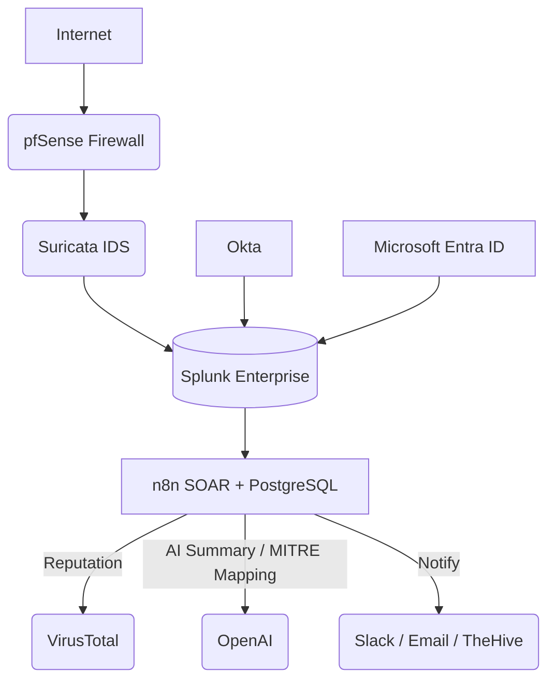

# 🧠Open-Source SOC HomeLab

A full-scale, AI-enhanced Security Operations Center built entirely from open-source technologies.

#

🔍 **Project Overview**

This project walks you through building a real-world Security Operations Center (SOC) environment from the ground up — using open-source tools, automation, and AI enrichment.

The lab simulates the end-to-end SOC workflow:

From network traffic capture → intrusion detection → SIEM correlation → identity telemetry → AI-powered incident enrichment and automated response.

You’ll gain hands-on experience with every critical SOC layer — including network defense, identity monitoring, SOAR automation, and MITRE ATT&CK mapping.

🧩 **Key Objectives**

- ✅Build and configure an enterprise-grade SOC lab using free and open tools
- ✅Learn detection, correlation, and response workflows
- ✅Automate threat enrichment using OpenAI and VirusTotal APIs
- ✅Collect identity telemetry from Okta and Microsoft Entra ID
- ✅Map detections to MITRE ATT&CK and the Cyber Kill Chain
- ✅Document your process for a GitHub portfolio project
#
## ⚙️ Core Stack Overview

| Layer | Tool / Service | Function |
| :-------------------------- | :------------------------------ | :------------------------------------- |
| 🌐 **Perimeter Security**   | pfSense                         | Firewall, routing, log forwarding      |
| 🕵️ **Intrusion Detection** | Suricata                        | Real-time packet inspection & alerting |
| 📊 **SIEM**                 | Splunk Enterprise (no Docker)   | Log aggregation & correlation          |
| ⚙️ **SOAR Automation**      | n8n + PostgreSQL                | Automated enrichment and response      |
| 🧠 **AI Enrichment**        | OpenAI API                      | Alert summarization, MITRE mapping     |
| 🧬 **Threat Intel**         | VirusTotal API                  | IP/domain/file reputation lookups      |
| 👤 **Identity Layer**       | Okta + Microsoft Entra ID       | Sign-in & risk event telemetry         |
| 🧾 **Frameworks**           | MITRE ATT&CK / Cyber Kill Chain | Detection alignment & threat modeling  |

##
## 🧩 Data Flow Architecture

#

⚙️ Step 1 — pfSense Installation & Configuration

| Setting | Value                  |
| :------ | :--------------------- |
| OS Type | FreeBSD 64-bit         |
| CPU     | 2 vCPU                 |
| RAM     | 4 GB                   |
| Disk    | 20 GB                  |
| NIC 1   | WAN (Bridged or NAT)   |
| NIC 2   | LAN (Internal Network) |

1.2 **🧱 Installing pfSense on VirtualBox**

- Create the Virtual Machine (VM):

- Open VirtualBox and click New.

- Name it something like pfSense-Firewall.

- Set Type to BSD and Version to FreeBSD (64-bit).

*Allocate at least 2 GB RAM and 20 GB disk space (VDI, dynamically allocated).*

#

**Attach the pfSense ISO:**

Go to Settings → Storage, select the empty optical drive, and click the disc icon → Choose a disk file.

Locate and attach the downloaded pfSense-CE-*.iso.

**Configure Network Interfaces:**

pfSense needs at least two adapters:

A- dapter 1 (WAN):

Enable it and set Attached to: Bridged Adapter (this connects pfSense to your real network or Internet).

- Adapter 2 (LAN):

Enable it and set Attached to: Internal Network or Host-only Adapter (for internal lab traffic).

#

**Boot and Install pfSense:**

- Start the VM and press Enter to boot the installer.

- Choose Install pfSense (not LiveCD).

- Accept defaults for keymap and partitioning unless customization is needed.

- Once installation completes, remove the ISO (Devices → Optical Drives → Remove disk) and reboot.
  
#

**Initial Network Configuration:**

- After reboot, pfSense assigns interfaces automatically (you can confirm which is WAN and LAN).

- The default LAN IP is 192.168.1.1/24, accessible from any VM or host connected to the LAN adapter.

  

*Access the Web Interface:*

From your host machine or a connected VM, open a browser and visit:
https://192.168.1.1

Default credentials:

#
#

# 1.3 **Hardening**

Disable hardware offloading (required for Suricata):
System → Advanced → Networking

Uncheck Hardware Checksum/TCP Segmentation/Large Receive Offloading.
Save and reboot.

1.4 Image Placeholder

🕵️ Step 2 — Install Suricata on pfSense
2.1 Package Install

System → Package Manager → Available Packages → install suricata.

2.2 Interface Setup

Services → Suricata

Add interface: LAN (em1)

Mode: IDS (alert-only) → later IPS.

Home Net: 192.168.1.0/24

External Net: !$HOME_NET

2.3 EVE JSON Logging

Logging Settings

Enable EVE JSON.

Log types: alert, dns, http, ssh, tls, flow.

2.4 Rules

Enable ET Open ruleset → detect brute-force, malware, policy violations.

2.5 Image Placeholder
