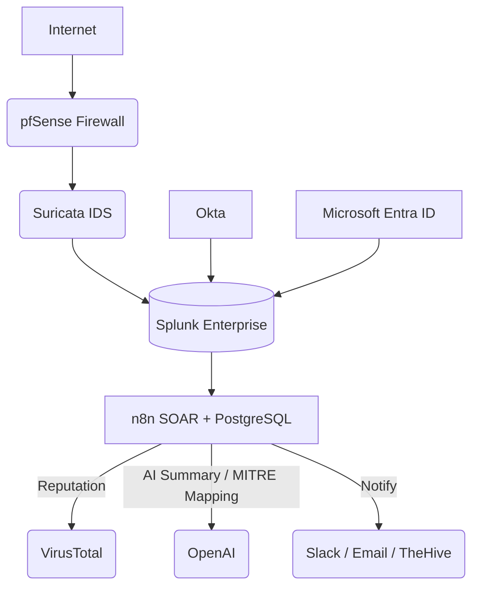

# 🧠Open-Source SOC HomeLab

A full-scale, AI-enhanced Security Operations Center built entirely from open-source technologies.

#

🔍 **Project Overview**

This project walks you through building a real-world Security Operations Center (SOC) environment from the ground up — using open-source tools, automation, and AI enrichment.

The lab simulates the end-to-end SOC workflow:

From network traffic capture → intrusion detection → SIEM correlation → identity telemetry → AI-powered incident enrichment and automated response.

You’ll gain hands-on experience with every critical SOC layer — including network defense, identity monitoring, SOAR automation, and MITRE ATT&CK mapping.

🧩 **Key Objectives**

- ✅Build and configure an enterprise-grade SOC lab using free and open tools
- ✅Learn detection, correlation, and response workflows
- ✅Automate threat enrichment using OpenAI and VirusTotal APIs
- ✅Collect identity telemetry from Okta and Microsoft Entra ID
- ✅Map detections to MITRE ATT&CK and the Cyber Kill Chain
- ✅Document your process for a GitHub portfolio project
#
## ⚙️ Core Stack Overview

| Layer | Tool / Service | Function |
| :-------------------------- | :------------------------------ | :------------------------------------- |
| 🌐 **Perimeter Security**   | pfSense                         | Firewall, routing, log forwarding      |
| 🕵️ **Intrusion Detection** | Suricata                        | Real-time packet inspection & alerting |
| 📊 **SIEM**                 | Splunk Enterprise (no Docker)   | Log aggregation & correlation          |
| ⚙️ **SOAR Automation**      | n8n + PostgreSQL                | Automated enrichment and response      |
| 🧠 **AI Enrichment**        | OpenAI API                      | Alert summarization, MITRE mapping     |
| 🧬 **Threat Intel**         | VirusTotal API                  | IP/domain/file reputation lookups      |
| 👤 **Identity Layer**       | Okta + Microsoft Entra ID       | Sign-in & risk event telemetry         |
| 🧾 **Frameworks**           | MITRE ATT&CK / Cyber Kill Chain | Detection alignment & threat modeling  |

##
## 🧩 Data Flow Architecture

#

⚙️ Step 1 — pfSense Installation & Configuration

| Setting | Value                  |
| :------ | :--------------------- |
| OS Type | FreeBSD 64-bit         |
| CPU     | 2 vCPU                 |
| RAM     | 4 GB                   |
| Disk    | 20 GB                  |
| NIC 1   | WAN (Bridged or NAT)   |
| NIC 2   | LAN (Internal Network) |

1.2 🧱 Installing pfSense on VirtualBox

- Create the Virtual Machine (VM):

- Open VirtualBox and click New.

- Name it something like pfSense-Firewall.

- Set Type to BSD and Version to FreeBSD (64-bit).

*Allocate at least 2 GB RAM and 20 GB disk space (VDI, dynamically allocated).*

#

**Attach the pfSense ISO:**

Go to Settings → Storage, select the empty optical drive, and click the disc icon → Choose a disk file.

Locate and attach the downloaded pfSense-CE-*.iso.

**Configure Network Interfaces:**

pfSense needs at least two adapters:

A- dapter 1 (WAN):

Enable it and set Attached to: Bridged Adapter (this connects pfSense to your real network or Internet).

- Adapter 2 (LAN):

Enable it and set Attached to: Internal Network or Host-only Adapter (for internal lab traffic).

#

**Boot and Install pfSense:**

- Start the VM and press Enter to boot the installer.

- Choose Install pfSense (not LiveCD).

- Accept defaults for keymap and partitioning unless customization is needed.

- Once installation completes, remove the ISO (Devices → Optical Drives → Remove disk) and reboot.
  
#

**Initial Network Configuration:**

- After reboot, pfSense assigns interfaces automatically (you can confirm which is WAN and LAN).

- The default LAN IP is 192.168.1.1/24, accessible from any VM or host connected to the LAN adapter.

  

*Access the Web Interface:*

From your host machine or a connected VM, open a browser and visit:
https://192.168.1.1

Default credentials:

1.3 Disable Hardware Offloading (Required for Suricata)

**In pfSense GUI:**

Go to: System → Advanced → Networking

*Check and enable:*

-✅ Disable hardware checksum offloading

-✅ Disable hardware TCP segmentation offloading

-✅ Disable hardware large receive offloading

Save & apply.

#

 
🕵️ Step 2 — Install Suricata on pfSense

 

2.1 — Install Suricata

1. Navigate to **System → Package Manager → Available Packages**  
2. Search for `suricata`  
3. Click **Install**  

---

Step 2.2 — Configure Suricata

1. Go to **Services → Suricata**
2. Click **+ Add Interface**
   - **Interface:** LAN  
   - **Enable:** ✅
3. Under **Global SettingsS:**
   - Enable **ET Open (Emerging Threats)** ruleset → detect brute-force, malware, policy violations.
     

4. Click **Save** and **Start Suricata**

**2.3 Enable EVE JSON and Syslog Logging**

1. In Services → Suricata → Interfaces → [LAN] → EVE Output:
    - Enable EVE JSON output
    - Check event types as needed:
      ` alert` `dns` `http` `tls` `ssh` `fileinfo` `etc`

2. Then, configure pfSense to send system logs to Splunk via syslog:

      - Go to Status → System Logs → Settings
      - Under Remote Logging Options:

       - ✅ Send log messages to remote syslog server
       - ✅ Remote syslog server: 192.168.10.50:514 (replace with your SIEM IP)
       - ✅ Syslog Facility: local4 (or similar)
`Save.`

At this point, pfSense and Suricata are ready to send logs to Splunk.

#

 📊 Step 3.Splunk Setup

✅ 3.1 Download Splunk

  
✅ 1. Download Splunk
For Linux (DEB):
- Visit the Splunk download page. ``https://www.splunk.com/en_us/download``
- Sign-in or create an account and it would give you access to the download page.

Choose the version for Linux (RPM/DEB) depending on your system architecture:

But for this Project I will be using DED for Debian-based systems (Ubuntu, etc.)

DEB-based (Ubuntu, Debian):
- Open a terminal. 
- Paste the deb command you copied : ``  sudo wget -O splunkforwarder-9.4.3-237ebbd22314-linux-amd64.deb "https://download.splunk.com/products/universalforwarder/releases/9.4.3/linux/splunkforwarder-9.4.3-237ebbd22314-linux-amd64.deb" ``
- 

  
- Install the downloaded .deb package using dpkg. `` sudo dpkg -i ``

✅ 3.2 Start Splunk

Linux:
1. After installation, you need to start Splunk from the command line. Go to the directory where Splunk is installed:

``cd /opt/splunk/bin``

2. Start Splunk:

   ``sudo ./splunk start --accept-license``

  - Important: The --accept-license flag ensures that you accept the Splunk license agreement.

  - Splunk will prompt you to create a username and password for the admin account.

    #
✅ Access Splunk Web Interface

Once Splunk is running, you can access the web interface to start configuring and using Splunk.

Open a web browser and navigate to:

For local installation: http://localhost:8000

For remote installation: http://<server-ip>:8000

You should be prompted to log in with the admin username and password you created during the installation process.

 

#

🧩 STEP 4 — Configure Data Inputs in Splunk

4.1 ▶ Add UDP Syslog Input (for pfSense / Suricata) In Splunk:

  - Settings → Data Inputs → UDP → New Local UDP
  - Port: 514
  - Source type: syslog
  - Index: pfsense (create it if needed)
  - Save.

▶ Enable HTTP Event Collector (HEC)

This will be used by n8n later.

Go to Settings → Data Inputs → HTTP Event Collector

Click Global Settings:

✅ Enable HTTP Event Collector

Port: 8088

TLS: up to you (for lab, HTTP is fine on local network)

Create a token:

Name: n8n-soar

Source type: json

Index: soar (or another dedicated index)

Save and copy the Token Value (e.g. 6a12a0b1-3b99-4aef-824f-123456789abc)

🔍 4. Verify pfSense → Splunk Logs

Run this search in Splunk:

index=pfsense | stats count by host sourcetype

You should see logs from pfSense (and Suricata if you log via syslog).

#

👤 Step 5 — Integrate Okta & Microsoft Entra ID

  
5.1 Create an API token

  1. Sign in as an Okta admin → Security → API → Tokens
     

  3. Click Create Token, give it a name (e.g., SplunkCollector), copy the token value once.
      Example: `00abCDeFGhijkLmNOPQrsTuVWXYZ1234567890`

*Store it safely; that’s your $OKTA_API_KEY.*

5.2 Enable Splunk HTTP Event Collector (HEC)

In Splunk Web → Settings → Data Inputs → HTTP Event Collector → New Token

   - Name: `okta-logs`
   - Source Type: `json`
   - Index: `okta`
   - Copy the HEC token (e.g., `3E6A4E…`)
   - Ensure HEC is enabled and note the port (8088).
   - 

✅ 5.3 Test connectivity

On the collector VM:

         curl -s -H "Authorization: Splunk <YOUR_HEC_TOKEN>" \
     -H "Content-Type: application/json" \
     -d '{"event":"okta test"}' \
     http://<splunk_ip>:8088/services/collector/event

